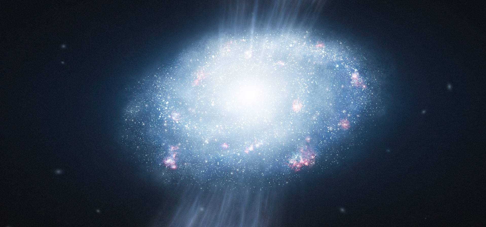

  

<h1 align="center">Chaitonna Prosad Barman</h1>

<h3 align="center">
Physics | Embedded Systems | Scientific Computing
</h3>

---

## 🧠 About Me

I am deeply interested in physics-driven technology and scientific problem-solving.  
My work focuses on combining theoretical understanding with practical implementation,
especially in computational and embedded domains.

---

## 🛠️ Skills

- 📐 LaTeX  
- 🔌 Embedded Systems
  

  

- 🐍 Python  
- 💻 C Programming  

---

## 🔗 Contact

- LinkedIn: https://www.linkedin.com/in/cp-barman10

---

  <em>Exploring physics through computation and systems.</em>

